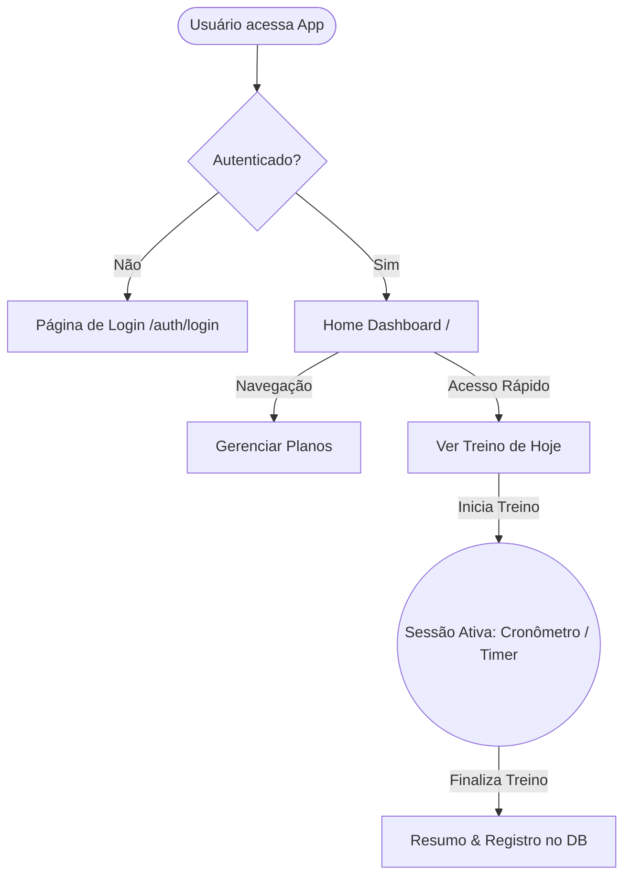

# 🏃‍♂️ TreinAI Web

<div align="center">

🌍 **App em Produção:** [www.treinai.space](https://www.treinai.space)

**Aplicação web moderna** desenvolvida para a experiência do usuário (UX) no gerenciamento de planos de treino, visualização rápida de dias ativos e execução guiada de exercícios interativos.

[](https://nextjs.org/)
[](https://react.dev/)
[](https://www.typescriptlang.org/)
[](https://tailwindcss.com/)
[](https://ui.shadcn.com/)
[](https://better-auth.com/)

</div>

---

## 🎯 Sobre a Interface

A interface **TreinAI Web** materializa o lado visual, tátil e interativo da nossa plataforma de gestão de performance humana. Planejada e projetada com convicção num paradigma "Mobile First", este cliente front-end atende de prontidão a urgência de um ambiente de academia, onde o tempo de olhar para a tela é mínimo e a clareza da instrução visual é vital. Tirando pleno proveito dos superpoderes do React e do framerwork hiper-otimizado Next.js, estabelecemos rotas rápidas e renderizações limpas para construir dashboards ricos sem abdicar de um carregamento imediato.

A vivência começa em um funil de onboarding e entrada que não impõe fricção. Assessorados pelas abstrações de middleware e integrados profundamente com o BetterAuth, levamos o utilizador logado em segundos ao epicentro produtivo do app: o Panorama Diário. Evitando a poluição de métricas supérfluas, priorizamos atalhos óbvios, posicionando imediatamente na palma da mão componentes que representam com precisão o "Treino do Dia". Ali, sem desvios cognitivos, o atleta está pronto para dar palco ao esforço.

Mais poderoso ainda é o que definimos como nossa "Sessão Ativa". Tão logo o botão de iniciar é acionado, a aplicação se transforma de um sistema gerencial para um parceiro vivo de treino. Com timers interativos, acompanhamento síncrono da tarefa atual e cronômetros automatizados para controlar janelas curtas de descanso, elevamos os padrões de foco do utilizador. Cercando essas mecânicas de uma casca estética impecável, dotada de persistência sofisticada em Dark Mode e enriquecida pela beleza dos blocos responsivos do escossistema shadcn/ui, entregamos a combinação utópica entre uma gestão granular do perfil biométrico e um controle formidável, prático e empolgante do momento do treino.

---

## 🛠 Tecnologias

| Tecnologia          | Versão | Descrição                                                   |
| :------------------ | :----- | :---------------------------------------------------------- |
| **Next.js**         | 16.1   | Framework React com renderização híbrida + App Router       |
| **React**           | 19.2   | Biblioteca de UI altamente reativa e concorrente            |
| **Tailwind CSS**    | 4.0    | Utilitários de CSS na nova versão de alta performance       |
| **shadcn/ui**       | 4.0    | Biblioteca de componentes acessíveis e elegantes            |
| **Orval**           | 8.5    | Geração de código (tipos/hooks) via OpenAPI da API Base     |
| **Ky**              | 1.14   | Cliente HTTP enxuto e moderno (substitui Axios/fetch puro)  |
| **React Hook Form** | 7.72   | Gerenciamento de formulários complexos e otimizados         |
| **Zod**             | 4.3    | Validação de formulários lado-cliente em paridade com a API |

---

## 🏗 Arquitetura & Fluxo

A estrutura aproveita fortemente a App Router Router (`app/`), isolando componentes (`components/UI`), e rotas interativas para o usuário.



### 🧩 Estrutura de Geração com Orval

Utilizamos `orval` para gerar automaticamente os clientes HTTP da nossa API Fastify, permitindo chamadas tipadas diretamente a partir do código React sem precisar recriar manualmente as interfaces TypeScript de cada DTO.

1. A API deve estar em execução servindo seus docs OpenAPI.
2. O arquivo `orval.config.ts` é encarregado de ler e gerar funções tipadas.
3. Essas requisições usam `ky` interactivamente no lado cliente.

---

## ⚙️ Configuração

### 🔐 Variáveis de Ambiente

Crie um arquivo `.env` ou `.env.local`:

```env
NEXT_PUBLIC_API_URL="https://api.treinai.space" # local: http://localhost:8080
NEXT_PUBLIC_APP_URL="https://www.treinai.space"   # local: http://localhost:3000
```

---

## 🚀 Execução

### 🔧 Pré-requisitos

- Node.js >= 20
- pnpm

### 🛠 Instalação

```bash
pnpm install
```

### 📡 Desenvolvimento

```bash
pnpm run dev
```

Essa ação inicia a aplicação padrão em: 👉 `http://localhost:3000`

### 🏗️ Build de Produção

```bash
pnpm run build
```

E para iniciar a versão de produção gerada:

```bash
pnpm run start
```

---

## 💅 Práticas de UI/UX e Estilização

- **Cores & Tema**: Usamos paletas de cores estritas de variáveis CSS, para garantir visibilidade máxima (padrões WCAG) com Dark/Light modes totalmente suportados.
- **Transições**: Utilização de bibliotecas como `framer-motion` / `tw-animate-css` para feedback imediato das ações do usuário.
- **Loading UI**: Implementação global do `loading.tsx` para apresentar blocos "Skeleton" bonitos nos instantes em que o servidor recupera dados.
